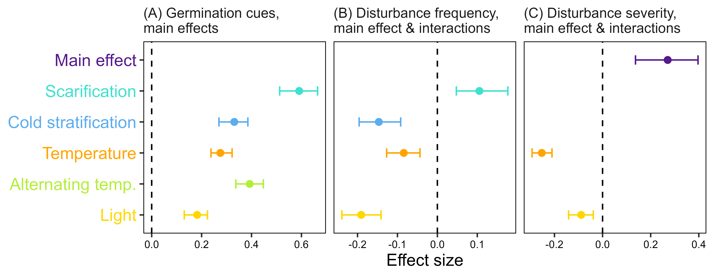
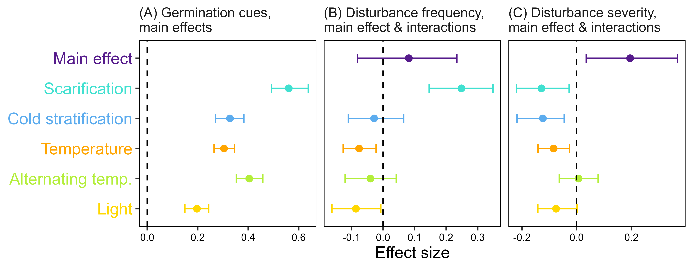

```{r setup, include=FALSE}
knitr::opts_chunk$set(echo = TRUE)
```

# Introduction

Developmental delay, a condition in which physiological development is arrested in conditions that are otherwise favourable, is common in many species [@RN5417; @RN5418]. Developmental delay usually results in reproduction delay and in an overall slower growth rate. This contrasts with the fact that early development and reproduction should be, in theory, associated with high individual fitness and favored by fecundity selection [@RN2384; @RN5408]. A widespread example of developmental delay is seed dormancy and delayed germination, in which a seed is not progressing towards germination even if placed in an environment with adequate levels of moisture and temperature. This happens because seed germination is a physiological process regulated by multiple environmental signals including water, temperature, light and chemicals [@RN3368]. In natural conditions, these signals interact to produce a multi-scale regulation of germination phenology, integrating environmental cues from long-term seasonal variation (e.g. dormancy release by overwintering) with short-term and microhabitat cues (e.g. light changes in the soil depth profile) [@RN3063]. This integrated response to multiple environmental cues ensures that seed germination happens at the right time and in the right place to maximize the probability of subsequent seedling survival [@RN2384]. The diversity of ways in which germination is controlled by the environment leads us to conclude that seeds are programmed to *not* germinate under many scenarios, i.e. delayed germination is widespread in the world's flora [@RN3214; @RN5391], even if less dormant and earlier germinating seed populations should produce more offspring and of a larger size within each year's reproductive cycle [@RN5398].

This apparent contradiction has traditionally been explained as an adaptation to environmental 'unpredictability'. The *bet-hedging hypothesis* poses that a seed population distributes its germination events across different environments/seasons to increase the chance that at least part of the seed population will successfully regenerate in face of unpredictable disturbances, such as erratic dry spells in a desert [@RN4915; @RN3217]. As pointed out by Pausas *et al.* [@RN5096], bet-hedging generally requires inter-annual environmental variability, i.e. saving some dormant offspring for regeneration in later years makes sense when there are unpredictable and wide differences in the regeneration potentials of different years. Alternatively, the *best-bet hypothesis* proposes that seeds have tailored germination requirements to be able to track predictable environmental changes, and therefore concentrate their germination in the most favorable regeneration window. To our knowledge, this strategy was named by the first time by Pausas *et al.* [-@RN5096], but its underlying logic has a long tradition in seed ecology, for example, in the interpretation by Baskin and Baskin [-@RN1406] of the different germination strategies of winter vs. summer annuals. Contrary to the view of Lamont and Pausas [-@RN5391], this type of delayed germination can be a response to predictable intra-annual seasonality. In the winter annual example, individuals shed their mature seeds in spring, but these seeds delay their germination until autumn, so seedlings avoid predictable drought during summer [@RN1406]. In this particular case, delayed germination is achieved by a requirement for summer after-ripening to overcome physiological seed dormancy [@RN1406], and this trait is understood to be essential for the winter annual life cycle [@RN5402]. To date, the macroecological patterns of dormancy and delayed germination have been studied using macroclimate as a surrogate for environmental 'unpredictability' [@RN5072; @RN5393; @RN5091; @RN5392]. These efforts have served to test and validate many aspects of the best-bet hypothesis as formulated in biogeographical seed ecology [@RN1406]. However, as pointed out recently [@RN5391; @RN5096], a needed next step is to go beyond macroclimate and focus on a more mechanistic description of disturbance as the true driver of delayed germination. 

Disturbance has been defined as a measurable loss of biomass in a biological community [@RN5394; @RN5409]. In the view of Grime [-@RN5409], disturbance and stress are the two most important factors shaping plant life histories. The r-K theoretical framework [@RN5410; @RN5411] predicts that high disturbance would select for short-lived annual plants producing many small and well-dispersed seeds, while low disturbance would select for long-lived perennials producing few and large seeds with low dispersal capacity [@RN5406], always considering that wide dispersal is associated to low seed mass [@RN4915]. These predictions were soon refined to consider a form of delayed development, i.e. delayed germination in the form of seed dormancy [@RN5412; @RN5413; @RN5414]. In this sense, dispersal and dormancy were alternative ways of dealing with habitat fluctuations, which led to an understanding of dormancy as a method of 'dispersal in time' [@RN5415]. By this logic, plants adapted to disturbed habitats could either have large and dormant or small and non-dormant seeds, and in fact a trade-off between dispersal distance and dormancy has recently been confirmed [@RN5415]. A systematic evaluation of life history strategies has been conducted using the temperate grasslands of Western Europe and North America as a model [@RN5406]. This simulation highlighted several important results: (1) dormancy is superior to dispersal as a method of coping with disturbance; (2) in large-seeded species, there was no advantage to being dormant irrespectively of disturbance; (3) dormant and non-dormant strategies coexisted at different levels of disturbance. This last fact supports the idea that different regeneration niches differing in the degree of delayed germination can support species coexistence [@RN5407]. Furthermore, the simulations [@RN5406] confirmed earlier experimental and theoretical work suggesting that increasing levels of disturbance produced a swift from perennial to annual life forms [@RN5410; @RN5411; @RN5416].

The relationship of disturbance with delayed germination has been extensively theorized and measured using fire-prone ecosystems [@RN5400; @RN5403]. Fire can act both as a cue for dormancy release (smoke, heat) and as a creator for optimal regeneration conditions (low competition, high resource availability, low predation, low pathogen load) [@RN5096]. However, this is expected to be advantageous only when fire intervals are shorter than the lifespan of the dominant species, and when they are sufficiently frequent and predicted to occur within the interval between plant maturation and senescence [@RN5396; @RN5397]. This leads to realize that it is necessary to contemplate the two essential aspects of disturbance: frequency and severity [@RN5394]. Frequency causes the match or mismatch between disturbance and the life cycles of species, while severity determines how advantageous the post-disturbance window can be for regeneration. Garmendia *et al.* [-@RN5399] employed a mathematical model to compare the benefits of bet-hedging over non-dormancy and concluded that bet-hedging adventages depended on the severity but not the frequency of disturbance.

In this article we have studied whether delayed germination is driven by species adaptations to disturbance frequency and severity in the European flowering plants. Rather than measuring delayed germination as the presence/absence of seed dormancy [@RN5393; @RN5091; @RN5392], we have considered the multi-faceted responses of germination to various germination cues including dormancy-breaking signals, temperature regimes and light [@@RN5072]. Based on the bet-hedge and best-bet hypotheses, we have tested the following predictions: (1) more frequent disturbances will promote responses to dormancy breaking signals with a shorter response time (e.g. positive germination responses to scarification simulating fire vs. responses to week-long chilling simulating winter); (2) more severe disturbances will result in more advantageous delayed germination (i.e. lower overall germination percentages across germination cues); (3) low frequency and low severity disturbance will switch species responses towards cues that indicate non-disturbance related favorable regeneration windows (e.g. warm summer temperatures or light availability in the soil surface).

# Methods

We performed all data analyses with R version 4.3.1 [@RN5387], using the R package 'tidyverse' [@RN4662] for data processing and visualization. The original datasets, as well as R code for analysis and creation of the manuscript can be accessed at the GitHub repository https://github.com/efernandezpascual/disturbance.

## Disturbance indicators and species names

We retrieved the species disturbance indicator values of Midolo *et al.* [-@RN5101]. For the purposes of this study, we kept only (1) disturbance frequency (the mean value of the disturbance return time, in years) and (2) disturbance severity (a proportional value, 0/1, of biomass loss in the community). We used the versions for the whole community, to account for biomass (and competition) changes for the whole community, i.e. including competition for light between regenerating seedlings and the canopy. To merge and homogenize this dataset with the germination dataset (see below), we standardized all species names using the World Checklist of Vascular Plants V.10 (@RN5389).

## Seed germination dataset

We obtained a seed germination dataset for European species by retrieving records from *SeedArc*, the global archive of primary seed germination data [@RN5388]. We define a record as a germination proportion of a given seed lot of a species, recorded in response to a given set of germination cues recreated in laboratory experimental conditions. 

To ensure data quality, we only retrieved records belonging to (1) angiosperms, to avoid the effect of gymnosperm branch lengths on subsequent phylogenetic analysis; (2) species present in the megatree of the seed plans by Smith & Brown [-@RN4754], a tree that would be used in subsequent analysis; (3) experiments conducted with seeds collected from wild populations in Europe, defined as the land between 30º W and 70º E and north of 30º N; (4) experiments conducted with either agar or filter paper as substrate; (5) experiments not using specialized treatments (e.g. sterilization, nitrates, plant hormones, UV light); (6) experiments not using complex dormancy breaking cycles including warm cycles, which could  be not comparable with simpler experiments; (7) experiments conducted with at least 5 but no more than a 1,000 seeds per experimental replicate; (8) species with data available for the disturbance indicator values.

Furthermore, to merge disparate original datasets, we simplified the germination cues by merging the originally-recorded treatment levels into simpler treatment levels that are routinely recorded in germination tests: (1) scarified vs. unscarified seeds (binary, 1/0); (2) cold-stratification vs. non-stratified seeds (binary, 1/0); (3) average germination temperature (numerical, in degrees); (4) alternating vs. constant temperatures (binary, 1/0); and (5) presence/absence of light during the experiment (binary, 1/0) (**Table 1**). These drivers are proxies of underlying quantitative variables that drive the physiological responses of seeds: the cardinal germination temperatures, the red:far red ratio, the length of the photoperiod, the amplitude of the diurnal thermal oscillations, the length and temperature of cold stratification, etc. The seed germination dataset is available in the data folder of the GitHub repository (see Data Availability Statement). 

## Statistical analysis

We tested the relationship between species dirturbance preferences and germination cues by fitting a generalized mixed model with Bayesian estimation (Markov Chain Monte Carlo generalized linear mixed models, MCMCglmms) as implemented in the R package *MCMCglmm* [@RN4755]. See Carta *et al.* [@RN5072] for an exhaustive description of the MCMCglmm methodology in the context of seed germination. 

In the model, the response variable was the germination proportion, and the fixed predictors were the germination drivers (scarification, cold stratification, temperature, alternating temperature and light), the disturbance indicators (frequency and severity), plus the interactions between germination drivers and disturbance indicators. Random effects included the source of germination data (lab or publication), the seed lot ID, species identity and a reconstructed phylogenetic tree for the study species to account for the effect of a shared phylogeny. To create the phylogeny we used the R package *U.PhyloMaker* [@RN5390] which contains an updated mega-tree of the seed plants based on Smith & Brown [-@RN4754]. As mentioned above, we only used species which were present in the tree. The phylogenetic tree is available in the data folder of the GitHub repository (see Data Availability Statement). Response variables were centered and scaled so their contribution to the effect sizes could be compared. 

We used weakly informative priors, with parameter-expanded priors for the random effects, as suggested by the package's author [@RN4755]. Each model was run for 1,000,000 MCMC steps, with an initial burn-in phase of 200,000 and a thinning interval of 1,000 [@RN4756], resulting, on average, in 9,000 posterior distributions. From the resulting posterior distributions, we calculated mean parameter estimates and 95% highest posterior density and credible intervals (CI). We interpreted the significance of model parameters by examining CIs, considering parameters with CIs overlapping with zero as non-significant. The R script to fit the model, and the fitted model object, are available at the GitHub repository (see Data Availability Statement).

# Results

The combined germination dataset contained 17,833 records of 1,386 species. The total number of seeds used in the experiments was 812,380. Experiments had used scarified seeds in 3,450 records (19%) and cold-stratified seeds in 2,707 records (15%). The average temperatures of the experiments ranged from 0 to 40 ºC, with an average of 18 ºC. Alternating temperatures had been used in 7,444 records (42%) and light in 16,303 records (91%). According to the MCMCglmms (**Fig. 1A**), all the germination cues had a positive main effect, i.e. overall, germination proportions across species were significantly improved by scarification, cold-stratification, warmer temperatures, alternating temperatures and light.

According to the MCMC model (**Fig. 1B**), disturbance frequency did not have a main effect on germination proportion, i.e. seeds germinated similarly independently of their disturbance frequency incubator. However, frequency had a significant positive interaction with scarification and significant negative interactions with cold stratification, temperature and light. This indicates that species adapted to more frequent disturbances have a stronger need for scarification, germinate better at lower temperatures and have a lesser need for light during germination (**Fig. 2C**). 

The same MCMC model (**Fig. 1C**) indicated a significant main effect of disturbance severity, i.e. species adapted to more severe disturbances also have an overall higher germination proportion. In addition, severity had significant negative interactions with temperature and light, so species adapted to more severe disturbances germinate better at lower temperatures and have a lesser need for light during germination (**Fig. 2B**). 

Phylogenetic signal was high in the model (lambda = 0.78, CI = 0.72 to 0.83). Of the random factors, the one with the largest effect was phylogeny (mean = 12.37, CI = 8.43 to 16.27), followed by data source (mean = 2.78, CI = 1.88 to 3.73), seed lot (mean = 2.23, CI = 2.02 to 2.45) and species identity (mean = 1.45, CI = 1.08 to 1.79).

# Discussion

* Theoretical background needs to be very solid and the hypotheses must be robust. Please check well the introduction.

* Our results seem to contradict the traditional understanding that more severe disturbance equals more dormancy.

* Our results seem to contradict the traditional understanding that segetal weeds need light to germinate in order to increase their emergence at the soil surface after a soil disturbance [@RN5401; @RN5404; @RN5405].

* We need to consider the importance of lifeform/lifespan and seed mass.

* Several of the relationships (check Figure 2) seem unimodal, should we use quadratic models.

* We need to decide if to use whole-community or herb-layer indicators. There are different results. Check the two pairs of figures.

# Data availability

The original datasets, as well as R code for analysis and creation of the manuscript can be accessed at the GitHub repository https://github.com/efernandezpascual/disturbance. Upon publication, a version of record of the repository will be deposited in Zenodo.

# References

::: {#refs}
:::

# Figures (whole community indicators)

```{r fig1, echo = FALSE, fig.pos = "H", fig.cap = "Figure 1 Germination proportions across the whole dataset as a function of disturbance. Left panels (A) show the response to disturbance frequency; right panels (B) show the response to disturbance severity. Each panel shows a scatter plot of germination proportions vs. germination frequency or severity, and a loess fit of the relationship. In each panel, points are grouped by levels of the germination cue: scarification (yes/no), cold stratification (yes/no), average temperature (above/below the mean temperature in the dataset), alternating temperature (yes/no) and ligh (yes/no)."}

```

```{r fig2, echo = FALSE, fig.pos = "H", fig.cap = "Figure 2 Effect sizes of germination cues and their interaction with disturbance indicators on final germination proportions. Dots indicate the posterior mean of the effect sizes, and whiskers the 95% credible interval of the effect size. The line of zero-effect is shown: when a credible interval overlaps with the zero-effect line, the effect can be regarded as non-significant, and is not shown. Panel (A) shows the main effect of the germination cues; panel (B) the main effect of disturbance frequency and its interaction with germination cues; and panel (C) the main effect of disturbance severity and its interaction with germination cues. "}
knitr::include_graphics("../results/figures/loess.png")
```

# Figures (herb layer indicators)

```{r fig1b, echo = FALSE, fig.pos = "H", fig.cap = "Figure 1 Germination proportions across the whole dataset as a function of disturbance. Left panels (A) show the response to disturbance frequency; right panels (B) show the response to disturbance severity. Each panel shows a scatter plot of germination proportions vs. germination frequency or severity, and a loess fit of the relationship. In each panel, points are grouped by levels of the germination cue: scarification (yes/no), cold stratification (yes/no), average temperature (above/below the mean temperature in the dataset), alternating temperature (yes/no) and ligh (yes/no)."}

```

```{r fig2b, echo = FALSE, fig.pos = "H", fig.cap = "Figure 2 Effect sizes of germination cues and their interaction with disturbance indicators on final germination proportions. Dots indicate the posterior mean of the effect sizes, and whiskers the 95% credible interval of the effect size. The line of zero-effect is shown: when a credible interval overlaps with the zero-effect line, the effect can be regarded as non-significant, and is not shown. Panel (A) shows the main effect of the germination cues; panel (B) the main effect of disturbance frequency and its interaction with germination cues; and panel (C) the main effect of disturbance severity and its interaction with germination cues. "}
knitr::include_graphics("../results/figures/loess-herb.png")
```