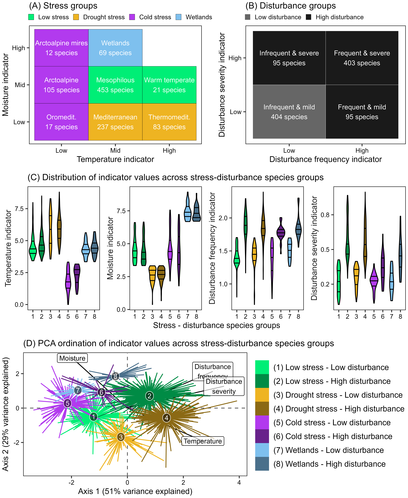
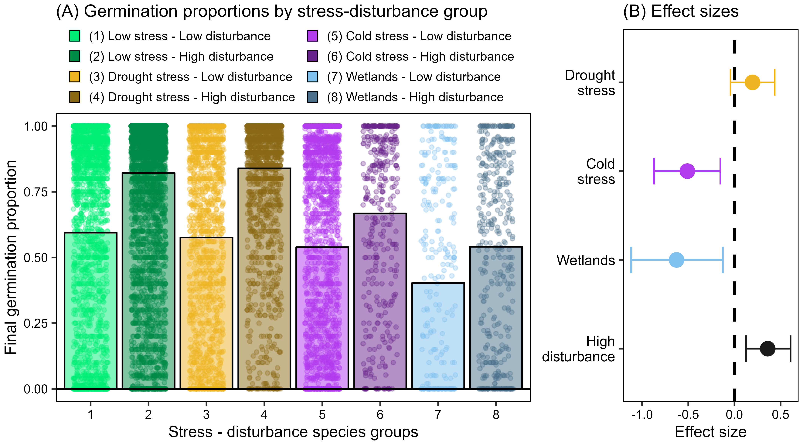
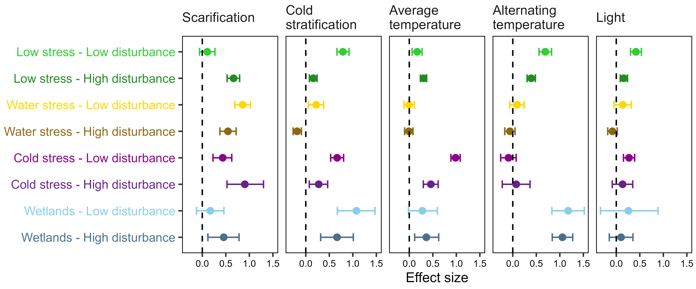

```{r setup, include=FALSE}
knitr::opts_chunk$set(echo = TRUE)
```

# Abstract

1. Questions: Seeds of many plant species are programmed not to germinate under various environmental scenarios. Thus, delayed seed germination is widespread, despite the higher fitness expected for earlier germinating seeds. We explore delayed germination by testing the hypothesis that it is a mechanism to cope with stress and disturbance during regeneration.

2. Location: Europe.

3. Methods: We retrieved 14,357 records representing 997 species from SeedArc, a global seed germination database. We classified species into four stress groups (low, drought, cold, wetlands) and two disturbance groups (low, high) using their ecological preferences for temperature, moisture and disturbance. We tested the likelihood of delayed germination as a function of stress-disturbance using phylogenetically informed meta-analysis. 

4. Results: Delayed germination is more likely in species adapted to cold stress and wetlands, and less likely in species adapted to disturbance. Species adapted to low stress and low disturbance present some degree of delayed germination. Different stress-disturbance groups respond differently to germination cues. 

5. Conclusions: Delayed germination is widespread in temperate flowering plants and works as a mechanism to cope with stress, disturbance and competition. The regeneration niche of the angiosperms shows a fundamental divide between those adapted to cold and those adapted to drought.

**Running title:** Delayed seed germination, stress and disturbance

**Keywords:** Plant reproduction, plant regeneration, regeneration niche, seed dormancy, seed germination, delayed development, cold stress, drought stress

# Introduction

Developmental delay is a condition in which a developmental process is arrested even though the environment is favorable for its completion, resulting in slower growth rates and a delay in reaching the reproductive stage [@RN5417; @RN5418]. Developmental delay is common in many organisms across the tree of life [@RN5417; @RN5418], even though early development and rapid reproduction should be, in theory, associated with high individual fitness and thus favored by fecundity selection [@RN2384; @RN5408].  A widespread example of developmental delay in plants is delayed seed germination, i.e. the situation in which a seed may not germinate even if exposed to moisture and temperature conditions favorable for post-germination survival and development [@RN5408]. Delayed seed germination can result from two factors: inherent seed dormancy [@RN2877; @RN3214; @RN3063] and environmentally imposed delayed seed germination [@RN5391]. Inherent seed dormancy is a state in which physicochemical properties of the seed prevent progress towards germination even if external signals are otherwise suitable [@RN3063; @RN3214]. Environmentally imposed delayed seed germination (referred to as 'imposed dormancy' in Lamont & Pausas [-@RN5391]) results from the absence of external environmental cues required for triggering germination; such specific cues include levels and combinations of moisture, temperature, light and chemicals [@RN3368]. These two kinds of factors (inherent and imposed) have been the subject of a long terminological debate in plant ecology and physiology [@RN3254; @RN5391] but, regardless of semantic issues, both provide mechanisms for the ecophysiological function of delayed seed germination. It is important to note that, in many plant species, the set of conditions allowing seed germination (i.e. the germination niche) is different from the set of conditions in which individuals can grow, and populations persist. In other words, the seeds of many species are programmed *not* to germinate under many environmental scenarios in which conditions may be suitable in the short term for germination and seedling survival, but not in the long term for plant growth and reproduction. This implies that delayed seed germination is widespread in the world's flora [@RN3214], despite hypothetical gains in plant fitness that might otherwise result from earlier germination, allowing for an extended vegetative growth period and subsequently the production of more offspring within each reproductive cycle [@RN5398].

Delayed seed germination has been understood as a regulator of regeneration phenology, integrating environmental cues from long-term seasonal variation (e.g. physiological dormancy release by overwintering) with short-term and microhabitat cues (e.g. light changes in the soil depth profile) [@RN3063]. This regulation would ensure that seeds germinate in the right place at the right time, maximizing the probability of subsequent seedling survival, growth and reproduction [@RN2384]. In the plant regeneration process, delayed seed germination can only be adaptive in the presence of temporally heterogeneous regeneration environments with variable odds of seedling survival and growth [@RN5096]. If the temporal occurrence of favorable regeneration environments is unpredictable (e.g. erratic rain events in a desert), the *'bet-hedging hypothesis'* proposes that delayed seed germination within a seed population can act to distribute germination events across different times, increasing the chance that at least part of the seeds produced by a given plant will germinate during a favorable timeframe conducive to life cycle completion [@RN4915; @RN3217]. Alternatively, if the temporal occurrence of favorable regeneration environments occurs regularly (e.g. snowmelt in an alpine snowbed), the *'best-bet hypothesis'* proposes that seeds can have specific germination requirements that track predictable environmental changes and therefore concentrate their germination in the most favorable regeneration window. To our knowledge, the term *'best-bet hypothesis'* was recently coined by Pausas *et al.* [-@RN5096], but its underlying logic has a long tradition in seed ecology, for example, in the interpretation of germination strategies in winter vs. summer annuals in response to predictable intra-annual seasonality [@RN1406]. In winter annuals, individuals shed their mature seeds in spring, but those seeds delay their germination until autumn, so seedlings avoid predictable drought during summer [@RN1406]. In this case, delayed seed germination is achieved by a requirement for summer dry-hot conditions to overcome physiological seed dormancy [@RN1406], plus an environmental delay caused by inadequate levels of temperature and moisture in the soil [@RN5468], and these traits are understood to be essential for the winter annual life cycle in temperate seasonal environments [@RN5402]. 

To date, the macroecological patterns of delayed seed germination have been studied using macroclimate as a surrogate for regeneration environment favorability [@RN5072; @RN5480; @RN5091; @RN5392]. These efforts have served to test and validate many aspects of the best-bet hypothesis as formulated by biogeographical seed ecology [@RN3214]. However, as pointed out recently [@RN5391; @RN5096], the next step needed is to go beyond macroclimate and focus on the various aspects of the regeneration environment that determine its suitability and its relation to delayed seed germination, e.g. habitat features [@RN5625]. Since the major drivers of plant life histories are linked with stress and disturbance [@RN5409], we may expect that these are relevant factors to explain the favorability of regeneration environments. Grime [-@RN5409] defined stress as an external constraint to the rate of dry matter production in all or part of the vegetation. In the regeneration process, environmental stress has been described as the existence of a non-suitable season for germination and seedling establishment, resulting in suboptimal seedling growth or even mortality, and has usually been linked to macroclimatic patterns of frost and drought [@RN3132]. Plants adapted to frost or drought should have germination traits that ensure that seed germination is delayed during the cold or dry season, respectively [@RN3132; @RN3214]. Examples for temperate regions include alpine plants with seeds whose physiological dormancy prevents germination during autumn and winter [@RN5480; @RN4965]; and Mediterranean species with cold-cued germination outside the summer dry season [@RN3268; @RN5072; @RN5625]. Independently from stress, disturbance has been defined as a measurable loss of biomass in a biological community [@RN5394; @RN5409]. The relationship of disturbance with delayed seed germination has been particularly studied in fire-prone ecosystems [@RN5400; @RN5403]. In these systems, fire can act both as a cue for dormancy release (smoke, heat) and as a creator for favorable regeneration conditions (low competition, high resource availability, low predation, low pathogen load) [@RN5096; @RN5672]. However, while fire-released dormancy is common in ecosystems where fire can be predicted to occur with a certain frequency within a seed’s lifespan, low dormancy is expected when disturbance frequency is particularly high [@RN5598]. Indeed, ecological theory [@RN5410; @RN5411] predicts that frequent disturbance should select short-lived annual plants producing many small seeds with a high capacity for dispersal in space [@RN4915], for example, ruderal annual plants adapted to disturbed anthropogenic habitats. Given the trade-off between seed dispersal in space and seed dispersal in time via delayed seed germination [@RN5415], we would expect highly disturbed environments to be associated with low inherent germination delay (i.e. low seed dormancy), as plants would escape from high disturbance by producing many low-cost and highly dispersible seeds with high germinability, to maximize the chance of germinating in a place with a favorable situation along the disturbance cycle (but this assumes that a mosaic of disturbance-cycle stages occur simultaneously in the landscape).

Here, we explore the patterns of delayed seed germination in response to stress and disturbance, the underlying drivers of regeneration environment suitability. We perform a meta-analysis of primary germination records using a large dataset representing 14,357 records of 997 species from 80 families of the European flowering plants. Rather than measuring delayed seed germination as the presence/absence of seed dormancy [@RN5480; @RN5091; @RN5392], our meta-analysis considers the multi-faceted responses of seed germination to various cues mapping onto inherent and externally imposed germination delays [@RN5072]. Based on the hypothesis that delayed seed germination is a mechanism to cope with stress and disturbance during the regeneration phase, we test the following two predictions: (1) delayed seed germination is more likely in species adapted to high stress and/or low disturbance; (2) specific germination cues driving delayed seed germination vary depending on species preferences for stress and disturbance following the predictions developed in **Table 1**.

```{r, layout="l-body-outset", echo = FALSE}
t1 <- read.csv("../results/tables/table1.csv", fileEncoding = "latin1", check.names=FALSE)
knitr::kable(t1, caption = "Environmental cues driving delayed seed germination in the European flowering plants. The table lists the cues included in our meta-analysis. For each cue, the table provides a description of the laboratory experimental treatment used as a proxy of the environmental cue, the theorized ecological function of the cue in regulating germination phenology, and our prediction in regard to the relationship between the cue and species preferences for stress and disturbance.")
```

# Materials and Methods

## Seed germination dataset

We prepared a curated pan-European seed germination dataset by retrieving records from *SeedArc*, the global archive of primary seed germination data [@RN5388]. We define a record as a germination proportion of a given seed lot of a species, recorded in response to a given set of germination cues recreated in laboratory experimental conditions. To ensure data quality, we only retrieved records belonging to:

1. Angiosperms, to avoid the effect of gymnosperm branch lengths on subsequent phylogenetic analysis. 

2. Species present in the megatree of the seed plants by Smith & Brown [-@RN4754], a tree that would be used in subsequent analysis.

3. Experiments conducted with seeds collected from wild populations in Europe and neighboring regions, between 30º W and 70º E and north of 30º N.

4. Laboratory experiments conducted with either agar or filter paper as substrate. 

5. Experiments not using specialized and uncommon treatments (e.g. sterilization, nitrates, plant hormones, UV light). 

6. Experiments not using complex dormancy breaking cycles with warm stratification or several steps (e.g. move-along experiments), which would be incomparable with simpler and more common experiments.

7. Seed lots for which at least one experimental treatment had produced at least 50% final germination, considering that otherwise, seed lots could have been affected by low viability rather than delayed seed germination.

8. Seed lots which had been tested at least in two experimental treatments, i.e. those which had a 'control' treatment against which to test delayed seed germination.

9. Experiments conducted with at least 10 but no more than 1,000 seeds per experimental replicate (e.g. Petri dish). 

10. Species with data available for the ecological indicator values (see next subsection, 'Stress and disturbance groups'). 

Furthermore, to merge the heterogeneous original records, we simplified the germination cues by merging the originally recorded treatment levels into simpler treatment levels (described in **Table 1**) that are routinely recorded and comparable across germination tests. These cues are proxies of underlying quantitative variables that drive the physiological responses of seeds, e.g. the heat thresholds for scarification, the length and temperature of cold stratification, the cardinal germination temperatures, the amplitude of the diurnal thermal oscillations, the length of the photoperiod, etc. Further, to merge and homogenize this dataset with the stress-disturbance dataset (see below), we standardized all species names using the World Checklist of Vascular Plants V.10 [@RN5389]. For a detailed description of the germination dataset and its representativeness, see **Supporting Information S1**.

## Stress and disturbance groups

We classified species in the germination dataset based on their preferences for stress and disturbance. We based this classification on species ecological indicator values (EIVs) for temperature, moisture, disturbance frequency and disturbance severity [@RN5488; @RN5101]. EIVs were originally developed based on the distributional limits of adult plants [@RN5671], and should be reliable proxies of the major environmental constraints during seed germination, when compared across the European flora. EIVs describe the position of species along environmental gradients based on their typical occurrence within plant communities. Rather than representing strict environmental limits, EIVs approximate the average environmental conditions under which species most commonly occur as members of established plant communities. Because these values are derived from the distribution of adult plants, they do not directly represent the physiological germination niche. Regeneration niches may differ from adult niches due to ontogenetic niche shifts across the plant life cycle [@RN6012; @RN6011]. Nevertheless, when comparing large numbers of species across broad geographic gradients, adult plant distributions provide a useful macroecological proxy of the environmental regimes under which regeneration typically occurs [@RN3132]. In this context, EIVs are interpreted here as indicators of the environmental conditions experienced by species across their life cycle rather than as direct predictors of germination physiology. For example, we can expect a Mediterranean species having a low moisture EIV to have a drought-limited seed germination phenology. Similarly, we can expect an alpine species having a low temperature EIV to have cold-limited seed germination. Furthermore, EIVs are ordinal values, ordering species according to their optima along environmental gradients, and should not be mistaken with continuous numerical values [@RN5671]. Therefore, they can be used to create classes suited to test our predictions. For a detailed description of how we created the classes, see **Supporting Information S2**.

Our classification included four stress groups (**Fig. 1A**, low stress, drought stress, cold stress and wetlands) and two disturbance groups (**Fig. 1B**, low and high), resulting in 8 stress - disturbance groups (**Fig. 1C**). A Principal Component Analysis (PCA) of the indicator values (**Fig. 1D**) supported that our eight groups describe the ecological variability in the studied flora. One axis of variation separated species adapted to low disturbance from species adapted to high disturbance, with disturbance frequency and severity showing high covariation. A second axis, orthogonal to the disturbance axis, ordered species according to their stress group: the central space of this axis was occupied by low stress species, while the two extremes were occupied by species adapted to cold or drought stress. The wetland species were grouped close to the cold stress species.

```{r fig1, echo = FALSE, fig.pos = "H", fig.cap = "Stress-disturbance groups. (A) Combinations of temperature and moisture into four stress groups (low stress, drought stress, cold stress and wetlands). (B) Combinations of disturbance frequency and severity into two disturbance groups (low and high). (C) Distribution of indicator values (temperature, moisture, disturbance frequency and disturbance severity) in each of the eight stress-disturbance groups. (D) Principal Component Analysis (PCA) biplot of the indicator values, with species grouped and colored according to their stress-disturbance group. The labeled arrows indicate the contribution of the indicator values to the PCA axes."}

```

## Statistical analysis

We tested the variation in delayed seed germination among stress-disturbance groups by performing a meta-analysis of the germination dataset using binomial generalized mixed models with Bayesian estimation (Markov Chain Monte Carlo generalized linear mixed models, MCMCglmms) as implemented in the R package *MCMCglmm* [@RN4755]. A detailed description and appraisal of the MCMCglmm methodology in the context of seed germination meta-analysis is provided by Carta *et al.* [-@RN5072]. In our study, the response variable is the final germination proportion, i.e. the total number of germinated seeds out of the number of all viable seeds reported at the end of the experiment, based on routine viability assessment. Since in our study the germination test conditions (constant moisture supply and 95% of the tests with incubation temperature in the range 7-26 ºC) were generally adequate for seedling survival and growth, we assume that any significant deviation from 100% final germination represented a signal of delayed seed germination, i.e. of some seeds not having germinated despite immediate conditions having been favorable for seedlings.

To test our first prediction that delayed seed germination should be more likely in species adapted to high stress and low disturbance, we fitted a model across the whole dataset, with two predictors: stress (four levels; low, drought stress, cold stress, wetlands) and disturbance (two levels; low and high) (see model syntax in **Supporting Information S3**). The low stress - low disturbance group was the reference level to which all remaining groups were compared. We calculated models with and without a stress x disturbance interaction. As the interaction was not significant, in the following, presentation and interpretation of results are based on the model without interaction. 

To test our second prediction that the specific germination cues driving delayed seed germination should vary depending on the species preferences for stress and disturbance, we fitted separate models for subsets of the dataset representing each of the eight stress-disturbance groups, with germination cues (scarification, cold stratification, average temperature, alternating temperature and light) as predictors (see model syntax in **Supporting Information S3**). For model simplicity and ease of interpretation and presentation of results, we chose to fit separate models per group instead of one single model thus avoiding interactions. Nonetheless, during the analytical stage we fitted a single model with interactions, thus being able to confirm that model results did not change depending on the approach.

Predictor variables were centered and scaled so their contribution to the effect sizes could be compared. We used weakly informative priors, with parameter-expanded priors for the random effects [@RN4755]. In all models, random effects included (1) the source of the germination data (to account for between-study variation related to the research group or publication from which the data was extracted), (2) seed lot ID (to account for between-study variation related to differences in experimental settings, seed lot quality and storage conditions, etc.), (3) species identity (to account for between-study variation related to differences between study species' traits) and (4) a reconstructed phylogenetic tree for the study species (to account for shared phylogeny). We used the R package *U.PhyloMaker* [@RN5390] to produce a phylogeny for our species by pruning Smith & Brown’s [-@RN4754] updated mega-tree of the seed plants. In addition, to take into account the potential effect of seed mass on germination responses and species ecologies, we repeated the models with seed mass as a covariable, using the seed mass dataset curated by Carta *et el.* [-@RN5624]. The values of seed mass did not differ between stress-disturbance groups, and the inclusion of seed mass did not affect model outputs for the study variables. Therefore, we kept seed mass out of the analyses for simplicity.

Each model was run for 500,000 MCMC steps, with an initial burn-in phase of 50,000 and a thinning interval of 50 [@RN4756], resulting, on average, in 9,000 posterior distributions. From the resulting posterior distributions, we calculated mean parameter estimates and 95% highest posterior density and credible intervals (CI). We interpreted the significance of model parameters by examining CIs, considering parameters with CIs overlapping with zero as non-significant. We performed all data analyses with R version 4.3.1 [@RN5387], using the R package 'tidyverse' [@RN4662] for data processing and visualization. The original datasets, as well as R code for analysis and creation of the manuscript, can be accessed at Zenodo (https://doi.org/10.5281/zenodo.14849555).

# Results

## Testing prediction 1: delayed seed germination as a function of stress and disturbance

Regarding our prediction that delayed seed germination should be more likely in species adapted to high stress and low disturbance, we found that, independent of experimental conditions (i.e. across germination cues), final germination of species adapted to drought stress was similar to that of low-stress species, while species adapted to cold stress and wetlands had significantly lower germination (**Fig. 2**, detailed model output, including both fixed and random effects in **Supporting Information S3**). In ecological terms, these findings imply that species from temperature-limited and wetland ecosystems are more likely to show delayed seed germination. At the same time, high-disturbance species had significantly higher overall germination, i.e. species that typically occur in high-disturbance habitats tend to germinate more readily across several experimental treatments, and thus are less likely to display delayed seed germination.

```{r fig2, echo = FALSE, fig.pos = "H", fig.cap = "Seed germination delay across stress-disturbance groups. Lower germination proportion indicates more delayed germination in the group. (A) Final germination proportions in each of the eight stress-disturbance groups, across all germination records. The dots indicate the final germination proportion in each of the original germination records, and the bars indicate the average proportion per group. (B) Effect sizes of the MCMCglmm testing the effect of stress and disturbance on final germination proportion. The reference level is the low stress - low disturbance group. Dots indicate the posterior mean of the effect size for each stress group and the high disturbance group, and whiskers the 95% credible interval of the effect size. The line of zero-effect is shown: when a credible interval overlaps with the zero-effect line, the effect can be regarded as non-significant. Non-overlapping effects to the left of the zero-effect line indicate that the group has lower seed germination than the reference group, while non-overlapping effects to the right of the zero-effect line indicate that the group has higher seed germination than the reference group. "}

```

## Testing prediction 2: germination cues driving delayed seed germination

Regarding our prediction that the specific germination cues driving delayed seed germination should vary depending on the species preferences for stress and disturbance (**Table 1**), we found that most stress-disturbance groups responded positively to most germination cues (**Fig. 3**, detailed model outputs in **Supporting Information S3**). That is, independently from stress-disturbance preferences, the species in our pan-European dataset tend to be more likely to germinate after scarification, after cold stratification, at higher and alternating temperatures, and with light. However, the effect sizes of each cue varied among stress-disturbance groups, as shown by non-overlapping credible intervals. Specifically, there were several exceptions to the aforementioned general pattern: 

1. Scarification: No response to scarification was found in two groups: low stress - low disturbance and wetlands - high disturbance

2. Cold stratification: The positive response to cold stratification was stronger in the low disturbance than in the high disturbance groups, and it was negative in the drought stress - high disturbance group.

3. Average temperature: This factor had the strongest positive effect on the cold stress - low disturbance group, and was not significant in the two drought stress groups and in the wetlands - low disturbance group.

4. Alternating temperature: This factor had a positive effect on the low stress and wetland groups, independently of disturbance level; and had a negative effect on the cold stress – low disturbance group.

5. Light: Independent of disturbance, light availability only had a positive effect on the low stress and cold stress groups. 

```{r fig3, echo = FALSE, fig.pos = "H", fig.cap = "Germination cues driving delayed seed germination across stress-disturbance groups. Effect of germination cues (scarification, stratification, average temperature, alternating temperature and light) over the final germination proportions. Dots indicate the posterior mean of the effect size for each cue, and whiskers the 95% credible interval of the effect size. The line of zero-effect is shown: when a credible interval overlaps with the zero-effect line, the effect can be regarded as non-significant. Non-overlapping effects to the left of the zero-effect line indicate that the cue depresses seed germination, while non-overlapping effects to the left of the zero-effect line indicate that the cue promotes seed germination. In separate panels, the figure shows the effect of the germination cues in each of the eight stress-disturbance models."}

```

In general, these results agreed with our predictions (**Table 1**) with some exceptions: (i) scarification had a strong effect in the groups of species adapted to high disturbance, but also in species adapted to low disturbance and high stress (drought and cold); (ii) cold stratification had a strong effect on species adapted to cold stress, but also on species from the low stress - low disturbance group; and (iii) alternating temperature and light had a strong effect on species adapted to low stress; however, alternating temperatures also had an effect of wetland species while light also had an effect on species from cold stress environments.

# Discussion

Our results indicate that delayed seed germination is more likely in species adapted to low disturbance, cold stress and wetland conditions; and less likely in species adapted to low stress and drought stress. These results agree only partially with our first prediction (i.e. we had expected more germination delay in drought-stress than in low-stress species). This suggests that in water-limited ecosystems, the delay in germination is externally regulated: in such systems, no rainfall means no soil moisture and no germination; therefore, there is no strong need to regulate germination delay by inherent seed properties.

An additional explanation may relate to ontogenic niche shifts between adult plants and seeds [@RN6012; @RN6011]. Species that occupy drought-prone habitats as adults may nevertheless germinate during episodic periods of higher soil moisture following rainfall events [@RN5468]. Under such conditions, germination occurs in transient microsites that are wetter than the average conditions experienced by adult plants. Consequently, ecological indicator values reflecting adult distributions may not fully capture the environmental conditions under which germination takes place.

## Delayed seed germination is more likely in species adapted to cold stress than in species adapted to drought stress

We show that delayed seed germination is a feature of cold adapted species, in agreement with the described germination strategies of alpine species, which delay germination until spring thanks to a combination of cold stratification requirements and warm-cued germination [@RN4965]. At the same time, our models indicate that delayed seed germination is less likely in species from water-limited ecosystems, e.g. Mediterranean zonal habitats. Although not initially contemplated by our predictions, this result aligns with the ecological features of dry ecosystems, where delayed seed germination can be achieved by external environmental factors (i.e. environmentally imposed delayed seed germination) [@RN5391]. For example, regeneration phenology can be driven by the timing and intensity of rainfall events, which regulate soil water potential and create windows for seed germination [@RN3145; @RN5468]. Since our dataset comprises laboratory experiments where water is provided to saturation, we cannot assess the effect of this key driver of germination in water-limited ecosystems. The scarcity of data on germination responses to water, compared to the amount of research dedicated to germination responses to temperature, suggests that a concerted effort is needed to explore seed regeneration in arid ecosystems. This becomes especially important considering that our results point to a fundamental divide in regeneration between angiosperms adapted to cold and those adapted to drought.

## Delayed seed germination is less likely in species adapted to disturbance

Being relatively small and well protected, seeds are not affected by disturbance in the same way as adult plants, which can lose their aerial biomass or die. For seeds, a disturbance represents an opportunity for seedling establishment, for example by reducing competition from the established vegetation. In this sense, the importance of disturbance as a gap provider depends on how well the frequency and severity of disturbance align with the life spans of the seed and its potential competitors [@RN5396; @RN5397]. A systematic computer simulation of life history strategies using temperate grasslands as a model [@RN5406] concluded that delayed germination is superior to dispersal in space as a method for coping with disturbance. Our results contradict such conclusions. Our evaluation, based on a broader spectrum of disturbance regimes considering a sample of the European flora from different habitats and life forms, concludes that high disturbance leads to more rapid seed germination, i.e. to lower dormancy and higher germinability. It should be pointed out that our analysis did not account specifically for fire-related dormancy in fire-prone ecosystems [@RN5672], and our high-disturbance groups are more representative of ruderal synanthropic species. When disturbances are sufficiently frequent or severe to provide frequent or large regeneration gaps, the production of highly germinable seeds is favored, possibly as a way to occupy the more readily available regeneration gaps. It is to be remarked that, in terms of delayed seed germination, disturbance species behave similarly to drought stress species. Given that many of the disturbance-adapted synanthropic plants of Europe (e.g. ruderal plants, segetal plants, and species of trampled soils) have a Mediterranean and thermophilous origin [@RN5494; @RN5490], it can be hypothesized that disturbance-adapted germination strategies are a pre-adaptation to regeneration in water-limited ecosystems. Furthermore, disturbed bare soils dry out faster, suggesting an additional link between the functional responses to drought and disturbance.

## Some degree of delayed seed germination is found in species adapted to low stress and low disturbance

Our results indicate that delayed germination is widespread in the European flora, as we found a degree of delayed germination even in the low stress - low disturbance group (i.e. species which are infrequent in habitats characterized by cold stress, drought stress or high disturbance). Species in this low stress - low disturbance group are adapted to undisturbed and climatically mild ecosystems (e.g. broadleaved deciduous forests), where competition is high, and factors such as light may become the major drivers of plant strategies. It would seem that these competitive conditions also favor delayed seed germination. When conditions are stable and competition is high, the probability of a seed finding an available spatial gap is relatively low, as they are virtually non-existent (every empty gap/niche would be quickly preempted by the extant vegetation). Therefore, the chances for seed regeneration are only high when a temporal gap becomes available, e.g. a forest clearing after a windthrow. Also, in forest understories, seedling mortality could also result from continuous low light levels driving a photosynthetic deficit which, although exerted by extant canopy trees could, at the scale of the seedling, be interpreted as a stress factor [@RN5476]. In any case, we need to consider that our study only includes European angiosperms. The vegetation history of Europe (e.g. glaciation cycles, seasonal climate, long history of synanthropic flora and vegetation) has shaped the continental species pool that harbors a high proportion of species regularly experiencing stress and/or disturbance in one form or another. Therefore, to fully test delayed seed germination with relation to stress, we should include in our analysis floras adapted to truly stable and mild regeneration environments (e.g. tropical rainforests). Unfortunately, such floras are currently not adequately represented in seed germination data [@RN5478; @RN5388].

## Conclusions and future perspectives

In conclusion, this study shows that delayed seed germination is more likely in species adapted to cold stress or low disturbance. In species adapted to low disturbance, delayed seed germination seems to be the norm, even in stable environments without a marked unfavorable season for seed regeneration. This highlights the potential role of competition avoidance in developing delayed seed germination strategies. These conclusions are based on the assumption that lack of germination in our dataset generally represents delayed seed germination and not a lack of seed viability, caused for example by non-selfing, immature embryos, pests or seed mortality caused by the experimental treatments. The risk of low seed viability is minimized by our data quality criteria, and by the fact that the experiments used to create our dataset routinely perform seed viability tests. Moreover, any residual lack of seed viability in the dataset should not affect the conclusions, except if there was a differential reduction of viability in some stress-disturbance groups. To fully discard this possibility will require performing future studies using large datasets of high-quality seed germination data.

Another aspect that could influence germination responses across stress–disturbance regimes is the diversity of seed dormancy types among species. Different dormancy mechanisms (e.g., physiological, physical or morphophysiological dormancy) regulate germination timing through distinct environmental cues [@RN3214; @RN6014]. Because our dataset focused on widely comparable germination treatments, complex dormancy-breaking protocols such as warm stratification, move-along treatments to expose seeds to a series of temperature regimes that simulate annual seasonal cycle, or other multi-step treatments were excluded. While this approach maximizes comparability across studies, it may result in the underrepresentation of certain dormancy mechanisms, e.g., morphophysiological dormancy in forest herbs adapted to low disturbance and stress [@RN568]. Integrating macroecological analyses with detailed dormancy classifications [@RN5480] represents an important direction for future research.

In this work, we have furthered the traditional understanding that delayed seed germination results from unfavorable regeneration environments, by deconstructing the concept of regeneration unfavourability along axes of stress and disturbance. Future studies will need to extend the analysis to other floras, improving our knowledge of tropical and arid biomes, and producing curated data from macroecological experiments that carefully control seed and adult environments, species life forms and functional traits, habitats (e.g. forests vs. shrublands vs. grasslands vs. wetlands) and separate stress factors (e.g. temperature, moisture, light, salinity). Such experiments will continue to shed light on delayed seed germination, which appears to be a widespread functional feature of the seed plants.

# References

::: {#refs}
:::

# Supporting Information

**Supporting Information S1** Geographical, phylogenetic and habitat representativeness of the seed germination dataset.

**Supporting Information S2** Extended methodology for the creation of the stress-disturbance groups.

**Supporting Information S3** Model syntax and detailed output summaries for the meta-analysis models.
