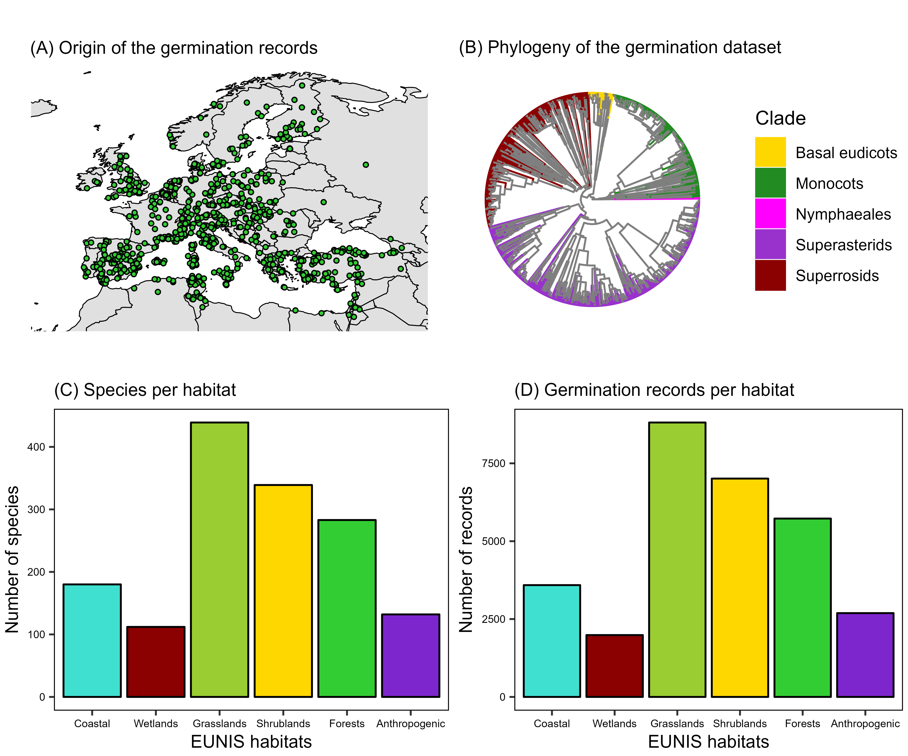

```{r setup, include=FALSE}
knitr::opts_chunk$set(echo = TRUE)
```

```{r message = FALSE, echo = FALSE, warning = FALSE}
knitr::knit_hooks$set(inline = function(x) {
  prettyNum(x, big.mark = ",")
})
```

```{r figS1, out.width = "450px", echo = FALSE, fig.cap = "Representativeness of the germination dataset. (A) Original coordinates of the seed collections used for the experiments that produced the germination dataset. (B) Phylogenetic tree of the species in the germination dataset, colored by the major angiosperms clades. (C) Number of species in the germination dataset that are characteristic species of the major European habitat types. (D) Number of records in the germination dataset belonging to species that are characteristic species of the major European habitat types. Habitats and characteristic species follow the EUNIS pan-European habitat classification system (https://doi.org/10.1111/avsc.12519)."}

```