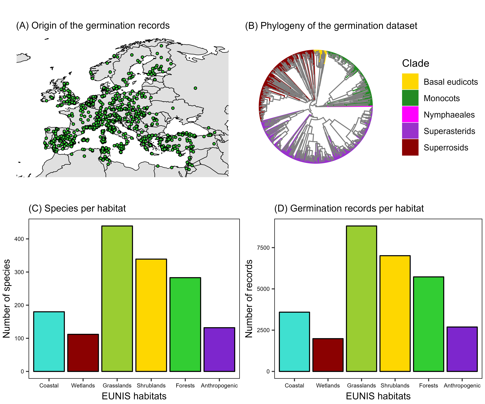

```{r setup, include=FALSE}
knitr::opts_chunk$set(echo = TRUE)
```

```{r message = FALSE, echo = FALSE, warning = FALSE}
knitr::knit_hooks$set(inline = function(x) {
  prettyNum(x, big.mark = ",")
})
```

## Representativeness of the germination dataset

The final germination dataset contained 14,357 experimental records obtained from 133 sources (i.e. research groups providing their primary germination data or published references from which data had been extracted). Experiments had been conducted with a total of 648,679 seeds from 3,185 seed lots. Maximum germination by seed lot was high: 95% of the seed lots had more than 70% max germination, with the average being 94%. Seed lots originated from Europe and neighboring regions, with 39 countries represented in the dataset (**Fig. 1**). The dataset included 997 species from 80 angiosperm families, representing the major clades of the angiosperms (**Fig. 1**). The dataset represented all the major European habitat types, considering both the numbers of species (**Fig. 1**) and the number of records (**Fig. 1**). Most species and records came from zonal and non-anthropogenic habitat types (i.e. forests, shrublands and grasslands; **Fig. 1**). Experiments used seeds that had been scarified before incubation in 2,974 records (21%); and seeds that had been cold-stratified before incubation in 2,252 records (16%). The average incubation temperatures of the experiments ranged from 0 to 40 ºC, with an average of 18 ºC, and 95% of the tests in the temperature range 6-26 ºC. Alternating temperatures had been used in 6,234 records (43%) and dark conditions in 1,166 records (8%).

```{r figS1, out.width = "450px", echo = FALSE, fig.cap = "Representativeness of the germination dataset. (A) Original coordinates of the seed collections used for the experiments that produced the germination dataset. (B) Phylogenetic tree of the species in the germination dataset, colored by the major angiosperms clades. (C) Number of species in the germination dataset that are characteristic species of the major European habitat types. (D) Number of records in the germination dataset belonging to species that are characteristic species of the major European habitat types. Habitats and characteristic species follow the EUNIS pan-European habitat classification system (https://doi.org/10.1111/avsc.12519)."}

```